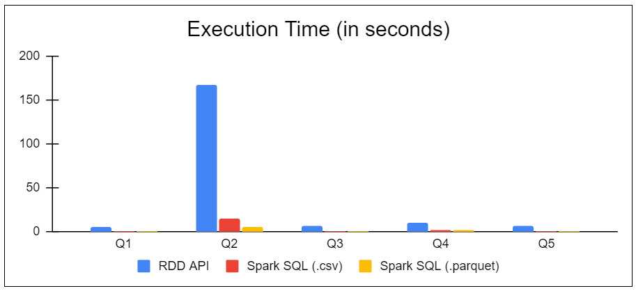

# *Query Execution in Apache Spark*

## *Introduction*

- For the final project, we are going to use Apache Spark to execute queries on datasets
- There are two basic APIs for query execution, the [RDD API](https://spark.apache.org/docs/2.4.4/rdd-programming-guide.html) and the [DataFrame/SQL API](https://spark.apache.org/docs/2.4.4/sql-programming-guide.html)

## *Dataset*

- In order to download the dataset you need to execute the following commands in your master machine.
    - `wget https://www.dropbox.com/s/yprrbtqhy0fi6os/datasets.tar.gz?dl=0`
    - `mv datasets.tar.gz?dl=0 datasets.tar.gz`
    - `tar -xzf datasets.tar.gz`
- We observe that the files are in **csv** format and we know that executing queries in this format is not efficient
- To optimize data access, databases traditionally load data into a specific designed binary format
- Spark has a similar approach and thus we will convert the dataset files to a special format named **parquet**
- The **parquet** file is a columnar file format designed for efficient data storage and retrieval. You can read more about it [here](https://parquet.apache.org/).
- The **parquet** file format has two major benefits:
  - *It has smaller footprint in memory and disk and therefore optimizes I/O, reducing execution time*
  - *It maintains additional information, such as statistics on the dataset, which helps on more efficient processing*

## *Task 1*

- We created a file directory on HDFS and uploaded the **csv** files
- We also converted the files to **parquet** and uploaded them on HDFS as well
- The following commands were used:
  - `./hdfs dfs -mkdir /lsdm_files`
  - `./hdfs dfs -mv /departmentsR.csv /lsdm_files/departmentsR.csv`
  - `./hdfs dfs -mv /departmentsR.csv /lsdm_files/employeesR.csv`
  - `./hdfs dfs -mv /departmentsR.csv /lsdm_files/movie_genres.csv`
  - `./hdfs dfs -mv /departmentsR.csv /lsdm_files/movies.csv`
  - `./hdfs dfs -mv /departmentsR.csv /lsdm_files/ratings.csv`

## *Task 2*

- In this task we used RDDs to query the dataset and provide the answears
- We were permitted to use either the **csv** or **parquet** files we uploaded
- The queries and code can be found [here](https://github.com/AlexandrosNakos/MSc-Data-Science-AUEB/blob/main/Large%20Scale%20Data%20Management/Queries/Queries%20-%20RDD.py)

## *Task 3*

- In this task we used Dataframes to query the dataset and provide the answears
- Here we used the **parquet** files we created and uploaded
- The queries and code can be found [here](https://github.com/AlexandrosNakos/MSc-Data-Science-AUEB/blob/main/Large%20Scale%20Data%20Management/Queries/Queries%20-%20Dataframe.py)

## *Task 4*

- In this task we used Spark SQL to query the dataset and provide the answears
- We used both the **csv** and **parquet** files we uploaded
- The queries and the code can be found [here](https://github.com/AlexandrosNakos/MSc-Data-Science-AUEB/blob/main/Large%20Scale%20Data%20Management/Queries/Queries%20-%20SQL%20(csv).py) (**csv**) and [here](https://github.com/AlexandrosNakos/MSc-Data-Science-AUEB/blob/main/Large%20Scale%20Data%20Management/Queries/Queries%20-%20SQL%20(parquet).py) (**parquet**)

## *Task 5*

- In this task, we measured the execution time of each query for each of the following scenarios:
  - *1. Map/Reduce - RDD API*
  - *2. Spark SQL on **csv** files*
  - *3. Spark SQL on **parquet** files*
- The results are displayed below

## *Conclusion*

- According to the results, we have a clear winner in terms of execution times
- Query execution using Spark SQL on **parquet** files seems to yield the best performance
- On the opposite side, MapReduce using the RDD API seems to be by far the less efficient choice
