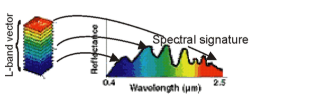
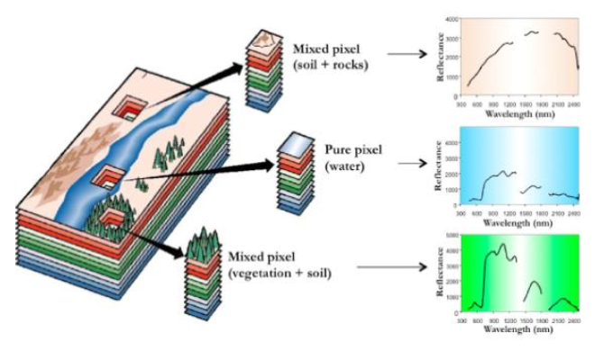

# *Hyperspectral Images Processing*

## *Introduction*

- A hyperspectral image depicts a specific scene at several $(L)$ narrow continuous spectral bands
- It can be represented by a $M \times N \times L$ three dimensional cube
- The first two dimensions correspond to the spatial information
- The third dimension corresponds to the spectral information
- Thus, the $(i,j)$ pixel in such an image, $i=1,...,M$, $j=1,...,N$, is represented by an $L$-dimensional vector
- This $L$-dimensional vector is called the ***spectral signature*** of the pixel

- In several remote sensing applications, the hyperspectral images are taken from satellites
- In such cases, they depict specific scenes of the earth surface at a specific spatial resolution
- That is, a single pixel may represent an area from $3 \times 3m^{2}$ to $100 \times 100m^{2}$ or more
- Each pixel is likely to depict more than one materials depicted in the corresponding area of the scene
- Such pixels are called ***mixed pixels*** and they are the vast majority of the pixels in the image
- On the other hand, there are (usually) a few pixels that depict a single material, called ***pure pixels***

## *Project Overview*

- In this project, we dealt with the usual procedures for processing hyperspectral images
- The usual processing procedures follow two main directions, the ***spectral unmixing*** and the ***classification***

#### *Spectral Unmixing*

- Assume that a set of $m$ spectral signatures corresponding to the pure pixels in the HSI under study is given
- For a given pixel, the aim is to determine the percentage to which each material contributes in its formation
- These percentages are known as the ***abundance maps*** for the given pixel
- Therefore it is clear that spectral unmixing provides ***sub-pixel information*** for a given pixel

#### *Classification*

- Assume that all pixels in the HSI under study are known to belong to one out of $m$ ***known classes***
- Given a specific pixel, the aim is to determine the most suitable class to assign it

## *Data*

- The data were provided in the context of the course content
- The data refer to the so called ***"Salinas" HSI***, which depicts an area of the Salinas valley in California, USA
- It is a $220 \times 120$ spatial resolution HSI
- It consists of $204$ spectral bands (from $0.2μm$ – $2.4μm$) and its spatial resolution is $3.7m$
- That is, the HSI is a $220 \times 120 \times 204$ cube
- The data are in the files `Salinas_cube.mat` (the Salinas hypercube) and `Salinas_gt.mat` (the class label for each pixel)
